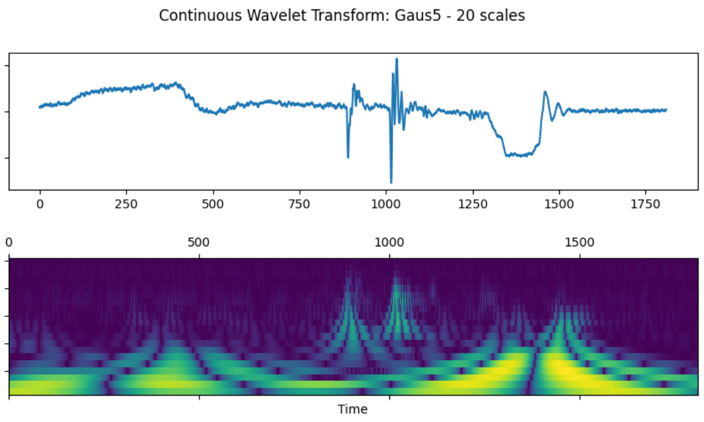
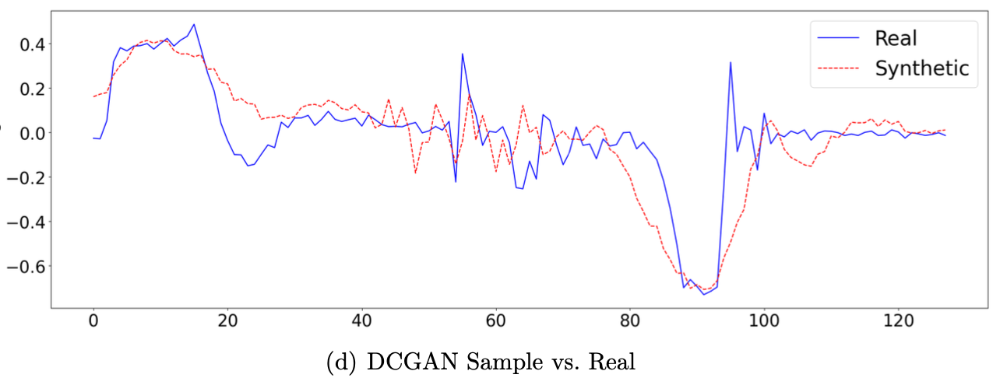

# Classifying Time Series with LSTMs, CNNs & Wavelet Transformation

Due to copyrights and a signed non-disclosure agreement, the __models__, __data__, and further information about the data have been removed from the repository. 
Further information about the approaches and theory can be found in the corresponding directory's `README.md`.
#
## 🕵️ Introduction

This work was part of a seminar during my mathematics studies, focusing on applying deep learning techniques to classify time series data.
The goal was to develop a deep-learning approach to classify time-series (TS) data using LSTMs, CNNs, and wavelet transformation. 
As an optional task, generative models can deliver synthetic data to provide a simple alternative for generating new, fresh data in the future, potentially improving the performance of the models.

## 💾 Raw Data Description

- \# of time-series: 33,727
- \# of features per time-series: 6 ($feature_1, feature_2, \ldots, feature_6$)
- \# of possible labels $y$: 4 ($class_0, class_1, class_2, class_4$)
- Relative frequency of labels: (11.5%, 24.9%, 37.2%, 26.4%)

## 💎 Solution & Evaluation

### 🛠️ Data Preprocessing

Since most deep learning models require input data of equal length, each time-series has been interpolated 
to an equal length using [`scipy.interpolate.interp1d`](https://docs.scipy.org/doc/scipy/reference/generated/scipy.interpolate.interp1d.html). After that, the data was standardized by dividing each value by its absolute maximum value to a range between [-1,1], making the training more stable.

### ⚙️ Algorithms

In the following, the task has been addressed by applying LSTM, CNN, and FCN (FullyCN). 
Since CNNs are usually known to perform well on grid-like data structures, the transformation of the time-series data into a wavelet image 
was performed, and CNN2D was applied.

Hyperparameter tuning was done using the [`HyperBand`](https://keras.io/keras_tuner/api/tuners/hyperband/) search algorithm from `keras-tuner`.

- LSTM on time-series using [LSTM](https://www.tensorflow.org/api_docs/python/tf/keras/layers/LSTM)
- CNN on time-series using [Conv1D](https://www.tensorflow.org/api_docs/python/tf/keras/layers/Conv1D)
- CNN on wavelets using [Conv2D](https://www.tensorflow.org/api_docs/python/tf/keras/layers/Conv2D)
- FCN on time-series using [Conv1D](https://www.tensorflow.org/api_docs/python/tf/keras/layers/Conv1D) and [GlobalAveragePooling1D](https://www.tensorflow.org/api_docs/python/tf/keras/layers/GlobalAveragePooling1D)

### 📈 Evaluation

In the domain scenario, misclassification of the algorithms cannot be treated equally due to safety reasons. 
Thus, in addition to [SparseCategoricalCrossentropy](https://www.tensorflow.org/api_docs/python/tf/keras/losses/SparseCategoricalCrossentropy), 
a suitable metric for the loss function has been derived to account for these inequalities. 
The following matrix $M$ is derived from the confusion matrix, reflecting the correct and incorrect classifications $\hat{y}$. 
Applying these during training, the loss can be calculated as $y^\intercal M \hat{y}$. 
The values $r$ and $f$ can be set arbitrarily by the user to apply weights to specific scenarios where misclassifications occurred.

$$ M=
\begin{pmatrix}
  0 & r & r & 2r \\
  f & 0 & f+r & r \\
  f & f+r & 0 & r \\
  2f & f & f & 0 \\
\end{pmatrix} \in \mathbb{R}^{4 \times 4}_{\geq 0}
$$

### <u>Final results:</u>

| Algorithm      | Precision (Test) | Loss (Test) | $M$ |
|----------------|------------------|--------|---------|-----|
| LSTM           | 0.9687           | 0.0642  | 0.0756 |
| CNN            | 0.9660           | 0.1093  | 0.0642 |
| FCN            | 0.9964           | 0.0147  | 0.0225 |
| CNN x Wavelets | 0.9690           | 0.1313  | 0.0642 |

#
## ✨Generating Synthetic Data

Initial approaches to generating synthetic data have been made by leveraging GAN architectures. 
These approaches require more computational power, so only raw samples could be produced, 
which already suggests that the original data can be approximated very well. This can be further explored in future work.

#
## 🔍 Project Structure

- **`CNN`**: Contains the implementation of the CNN models.
    - **`HyperSearchCNN.ipynb`**: A notebook for performing hyperparameter search on the classical CNN model.
    - **`EvaluateCNN.ipynb`**: A notebook for evaluating the best CNN model identified during the hyperparameter search.

- **`FCN`**: Contains the implementation of the FCN models.
    - **`HyperSearchFCN.ipynb`**: A notebook for performing hyperparameter search on the FCN model.
    - **`EvaluateFCN.ipynb`**: A notebook for evaluating the best FCN model identified during the hyperparameter search.

- **`GenerativeModel`**: 
    - **`GAN`**: Implements the GAN models.
        - **`DCGAN.ipynb`**: Experiments using [Deep Convolutional Generative Adversarial Network](https://www.tensorflow.org/tutorials/generative/dcgan).
        - **`TimeGAN.ipynb`**: Experiments using Time-GAN by [Jinsung Yoon et al. (2019)](https://proceedings.neurips.cc/paper_files/paper/2019/file/c9efe5f26cd17ba6216bbe2a7d26d490-Paper.pdf).
        - **`CompareGAN.ipynb`**: Loads the current DCGAN and TimeGAN models and creates synthetic data for demonstration.

- **`LSTM`**: Contains the implementation of the LSTM models.
    - **`HyperSearchLSTM.ipynb`**: A notebook for performing hyperparameter search on the classical LSTM model.
    - **`EvaluateLSTM.ipynb`**: A notebook for comparing and evaluating the two best LSTM models identified during the hyperparameter search.

- **`Metrics`**:
    - **`metrics.ipynb`**: Implements a metric for imbalanced datasets and a weighted loss function.

- **`utilities`**: A collection of frequently used functions.